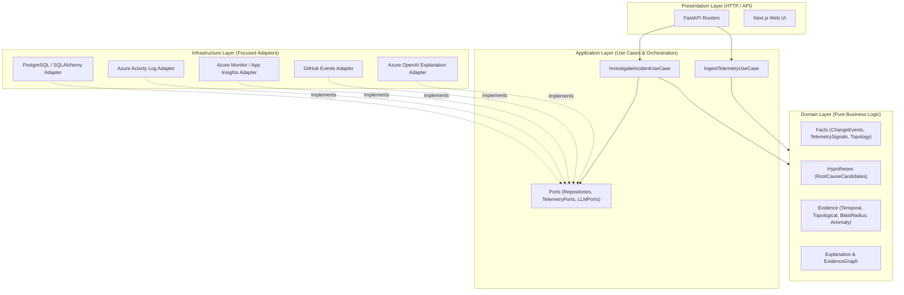
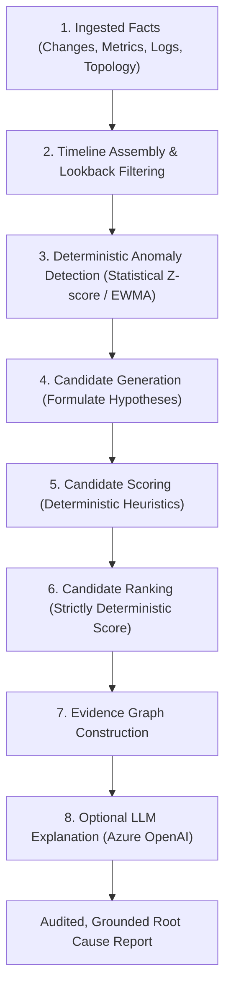

# TraceOps Architecture Specification

## 1. System Overview

TraceOps is a cloud incident investigation and root-cause intelligence platform designed to ingest cloud logs, deployment events, and telemetry signals to answer:  
*"What changed before my application broke, and which change is most likely responsible?"*

TraceOps follows a **Modular Monolith** architecture governed by **Clean Architecture** and **Hexagonal Architecture (Ports and Adapters)** principles.



---

## 2. Refined Domain Model: Facts, Hypotheses, Evidence, and Explanations

The domain model is strictly anchored around four distinct cognitive and operational concepts:

```
┌────────────────────────────────────────────────────────────────────────┐
│ 1. FACTS (Immutable Reality)                                           │
│    • ChangeEvent: Deployment occurred, config changed, ARM updated     │
│    • TelemetrySignal: Error count, latency metric measurement          │
│    • Topology: Service and dependency graph connections                │
│    • Anomaly: Statistically detected deviation in observed telemetry   │
└───────────────────────────────────┬────────────────────────────────────┘
                                    │ (identifies)
                                    ▼
┌────────────────────────────────────────────────────────────────────────┐
│ 2. HYPOTHESES (Potential Explanations)                                 │
│    • RootCauseCandidate: "Deployment X or Config Change Y is the      │
│      culprit responsible for Incident Z"                               │
└───────────────────────────────────┬────────────────────────────────────┘
                                    │ (evaluated by)
                                    ▼
┌────────────────────────────────────────────────────────────────────────┐
│ 3. EVIDENCE (Observable Proof & Deterministic Scoring)                 │
│    • Temporal Proximity: Change occurred t minus delta before failure  │
│    • Topological Distance: Shortest hop distance in dependency graph   │
│    • Anomaly Correlation: Statistical alignment with error rate spikes │
│    • Blast Radius: Historical and infrastructural scope of change      │
│    • EvidenceGraph: Directed graph linking culprit -> anomaly -> symptom│
└───────────────────────────────────┬────────────────────────────────────┘
                                    │ (synthesized into)
                                    ▼
┌────────────────────────────────────────────────────────────────────────┐
│ 4. EXPLANATION (Human-Readable Narrative)                              │
│    • Grounded Explanation: Synthesized strictly from the EvidenceGraph │
│    • The LLM is an explanation layer, NOT a decision maker             │
└────────────────────────────────────────────────────────────────────────┘
```

### Concept Definitions

1. **Facts**:
   - Immutable records of what actually occurred in the system.
   - Examples: `DeploymentEvent(service="auth", commit="a1b2c3", timestamp=10:00)`, `MetricSignal(service="auth", metric="p99_latency", value=420ms, timestamp=10:02)`.
   - Facts are collected from telemetry and logs; they are never generated or inferred.

2. **Hypotheses**:
   - Plausible candidate explanations for an observed incident.
   - Example: `RootCauseCandidate(change_id="change_101", target_service="auth")` represents the hypothesis that change `change_101` caused the outage.

3. **Evidence**:
   - Deterministic, observable measurements that support or weaken a hypothesis.
   - Examples:
     - *Temporal Proximity*: Change was deployed 3 minutes prior to the first error spike.
     - *Topological Relationship*: Impacted checkout service directly depends on the modified auth service (distance = 1).
     - *Blast Radius*: Change modified core database connection pools.
     - *Anomaly Alignment*: Error rate anomaly began precisely within the deployment rollout window.
   - Evidence is assembled into an in-memory `EvidenceGraph`.

4. **Explanation**:
   - A structured, human-readable narrative explaining why the top-ranked candidate is responsible, referencing explicit nodes in the `EvidenceGraph`.
   - The LLM translates structured evidence into text. It is **forbidden** from inventing hypotheses or manufacturing evidence.

---

## 3. The Root Cause Engine Architecture

The root cause engine is strictly deterministic and testable without network access or LLMs:



### The Inviolable AI Rule:
* The LLM does **NOT** decide the root cause.
* The LLM does **NOT** compute candidate scores or probabilities.
* The LLM receives an explicit JSON payload of verified evidence and translates it into an executive and engineering narrative.

---

## 4. Strict Dependency Direction Rules

Source-code dependency direction is strictly inward:

```
Presentation ──► Application ──► Domain
```
Infrastructure exists outside the inner layers and implements ports/interfaces defined by Application and Domain boundaries.

### Enforceable Boundary Rules

1. **Domain Layer Rules**:
   - The domain must contain pure Python entities, value objects, and domain exceptions.
   - **MUST NOT IMPORT**:
     - FastAPI or HTTP libraries
     - SQLAlchemy, SQLModel, database drivers, or ORMs
     - Pydantic (prefer standard Python dataclasses for domain purity)
     - Azure SDKs, GitHub SDKs, OpenAI SDKs
     - Infrastructure modules or concrete adapters
2. **Application Layer Rules**:
   - Contains use cases and defines abstract Port interfaces (protocols).
   - **MUST NOT IMPORT**: Concrete infrastructure adapters.
3. **Presentation Layer Rules**:
   - Handles HTTP routing, serialization, parameter validation, and invoking application use cases.
   - **MUST NOT CONTAIN**: Business logic, causal scoring, candidate ranking, or direct persistence queries.
4. **Infrastructure Layer Rules (Anti-Dumping Ground)**:
   - Adapters must have one clear, focused responsibility.
   - Adapters must implement one or more explicit Application Ports.
   - External providers must be isolated behind focused adapters (e.g. `AzureActivityLogAdapter`, `GitHubEventsAdapter`, not a monolithic `AzureGodService`).
   - Adapters **MUST NOT** contain domain decision logic or scoring algorithms.
   - Adapters **MUST NOT** perform unrelated orchestration across multiple systems.
   - Adapters **MUST NOT** call unrelated external APIs directly.

---

## 5. Simplicity & Anti-Over-Architecting (Solo-Developer Scale)

TraceOps is designed for maximum clarity, low cognitive load, and high maintainability for a solo engineer.

### Forbidden Architectural Elements (Unless Justified by Later Measured Needs):
* **NO** distributed microservices or service mesh.
* **NO** external message brokers (Kafka, RabbitMQ, Azure Service Bus).
* **NO** distributed task queues (Celery, Dramatiq) or caching layers (Redis).
* **NO** Kubernetes.
* **NO** complex Event Sourcing or CQRS architectures.
* **NO** specialized time-series databases (TimescaleDB) or dedicated graph databases.
* **NO** learned ML ranking models until deterministic scoring is validated against real incident data.

In-process execution, synchronous or standard Python async primitives, and relational PostgreSQL with standard indexing are fully sufficient.

---

## 6. Runtime & Deployment Architecture Clarification

* **Primary Development Environment**: Local environment (macOS) running Python via `uv`, Next.js via Node.js, and PostgreSQL via `docker-compose.yml`.
* **Azure Runtime Commitment**: Azure Container Apps (ACA) is a **candidate deployment target only**, not a final architectural commitment.
* **Database Commitment**: PostgreSQL locally via Docker Compose. The cloud database model (Azure Database for PostgreSQL vs. containerized PostgreSQL vs. other managed options) is explicitly deferred until the application workload and resource utilization patterns are measured.
* **Zero Resource Provisioning in Phase 0**: No cloud resources are provisioned in this phase.
