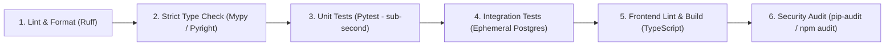

# TraceOps Development Environment & CI/CD Architecture

## 1. Local Development Principles

The development environment is designed to be **instant-on, isolated, and low friction**:
* **Backend Runtime**: Python 3.12+ managed via `uv` for sub-second virtualenv and package resolution.
* **Frontend Runtime**: Node.js 20+ (LTS) with `npm` or `pnpm`.
* **Local Backing Services**: Docker Compose providing PostgreSQL 16 (and optionally Azurite for local Azure blob emulation if needed).
* **Code Formatters & Linters**: `ruff` (linter and formatter) + `mypy` (strict type checking) running locally and in pre-commit hooks.

---

## 2. Directory Layout Recommendation

```
TraceOps/
├── .github/
│   └── workflows/             # GitHub Actions CI/CD pipelines
│       ├── ci.yml             # Lint, type-check, unit tests, integration tests
│       └── cd-preview.yml     # Optional dev branch preview deployment
├── docs/                      # Architectural documentation
│   ├── adr/                   # Architecture Decision Records
│   ├── architecture/          # High-level architecture and designs
│   ├── api/                   # API guidelines and schemas
│   ├── operations/            # Azure infra, cost, and operations
│   └── development/           # Standards and dev setup
├── infrastructure/            # Terraform configurations
│   ├── modules/               # Reusable modules (postgres, container_apps, etc.)
│   └── environments/
│       ├── dev/               # Development environment ($5-10/mo budget)
│       └── prod/              # Future production environment
├── backend/                   # Backend Modular Monolith
│   ├── pyproject.toml         # Dependencies and tool configurations
│   ├── src/
│   │   └── traceops/
│   │       ├── domain/        # Pure domain logic
│   │       ├── application/   # Use cases and port interfaces
│   │       ├── infrastructure/# Adapters (PostgreSQL, Azure, GitHub, OpenAI)
│   │       └── presentation/  # FastAPI REST API
│   └── tests/
│       ├── unit/              # Pure in-memory unit tests
│       ├── integration/       # Database and adapter tests
│       └── fixtures/          # Synthetic incident data sets
├── frontend/                  # Next.js Web Application
│   ├── package.json
│   ├── tsconfig.json
│   └── src/
│       ├── app/               # Next.js App Router pages
│       ├── components/        # Reusable UI components
│       └── lib/               # API clients and utilities
├── docker-compose.yml         # Local backing services (PostgreSQL)
├── AGENTS.md                  # AI coding assistant guardrails
└── README.md                  # Project overview and quickstart
```

---

## 3. CI/CD Architecture (GitHub Actions)

### Continuous Integration Pipeline (`ci.yml`)

Runs on every Pull Request and push to `main`:



### CI Philosophy
* **Fast Feedback**: Unit tests and linting must complete within 60 seconds.
* **Deterministic**: No external cloud service calls or network dependencies in CI unit tests.
* **Branch Protection**: Merging requires all checks to pass with 0 warnings.

---

## 4. Local Developer Commands

### Start PostgreSQL
```bash
docker compose up -d postgres
```

### Install Backend Dependencies
```bash
cd backend
python3 -m venv .venv
source .venv/bin/activate
pip install -e ".[dev]"
```

### Run Database Migrations
```bash
alembic upgrade head
```

### Run Quality Checks & Tests
```bash
# Formatting
ruff format --check .

# Linting
ruff check .

# Static type checking
mypy src tests

# Unit & Integration Tests
pytest -v
```

### Start the API Locally
```bash
python src/traceops/main.py
# Or with uvicorn directly:
# uvicorn traceops.main:app --host 0.0.0.0 --port 8001 --reload
```
